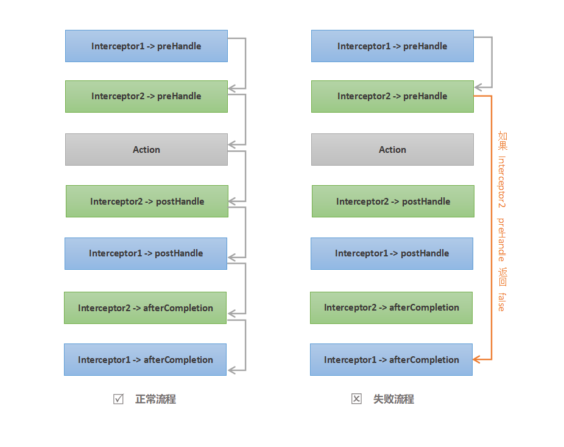

# spring-boot-netty-httprouter


## 简介

***当您在 Sprint Boot 项目中使用 netty 承载 restful 服务时 spring-boot-netty-httprouter 可以使您不必再手动进行请求与业务处理的绑定，spring-boot-netty-httprouter 可以根据您设置的映射规则，自动分发请求到对应的 action。同时由于支持 Spring Boot 的自动配置，您在项目中只需添加对应的依赖之后，无需进行额外配置即可开始使用。***


## 环境说明

***需要 JDK8 及以上版本。***


## 结构说明

- *common ： 为基础类库，目前只添加了少量的工具类*

- *projects 下的 netty.httprouter ：为 netty httprouter 实现项目*

- *samples 下的 netty.httprouter ：为 netty httprouter 示例项目*

> ***注：运行示例项目前，仍需要先将项目 deploy 到您的 maven 私服。***


## 使用方式

- *修改主项目中 pom 中的 distributionManagement 配置改为您自己的 maven 私服配置*

- *将整个项目 deploy 到您的 maven 私服*

- *在您自己项目的 pom 文件中添加 erola-spring-boot-netty-httprouter 依赖即可使用*
  

## 路由匹配

***路由匹配支持通配符匹配***

- *`?` 匹配单个字符*
  
    `/home/index?` 匹配 `/home/indexA` 、 `/home/indexB` 等，但是不配 `/home/index`

- *`*` 匹配0个或多个字符*

    `/home/index*` 匹配 `/home/index` 、`/home/indexA` 、 `/home/indexABC` 等，但是不匹配 `/home/index/ABC`

- *`**` 匹配1个或多个路径*

    `/home/index/**` 匹配 `/home/index/AAA` 、 `/home/index/AAA/BBB` 、 `/home/index/AAA/BBB/CCC` 等，但是不匹配 `/home/index`
  
- *对于同时有多条匹配记录满足的情况下，按照最长匹配优先的原则进行返回*

    `/home/indexA` 同时匹配 `/home/index?` 和 `/home/index*` ，但是由于 `*` 比 `?` 匹配的字符多，则返回 `/home/index?`

    `/home/indexABC` 同时匹配 `/home/index*` 和 `/home/indexAB*` ，由于 `/home/indexAB*` 匹配的非通配符长度长，则返回 `/home/indexAB*`
  
   > ***注：通配符匹配在实现的时候保持和 `Spring MVC` 的规则一致，尽量保持相同的使用习惯。***


## 自定义拦截器

***路由匹配支持通过注解的方式添加自定义拦截器***

- 拦截器支持添加在 `controller` 或 `action` 上，如果您在 `controllre` 上添加了拦截器，则该 `controller` 中的所有 `action` 都会应用该注解

- 拦截器同时也支持继承，如果您在 `controller` 的父类上添加了注解，则该类的所有子类 `controller` 中的所有 `action` 都会应用该注解

- 创建您的自定义拦截器类，实现 `IInterceptor` 接口或者继承 `SimpleInterceptorAdapter` 类，例如：

    ```java
    @Component
    public class InterceptorExample extends SimpleInterceptorAdapter {

        @Override
        public boolean preHandle(FullHttpRequest request, FullHttpResponse response, Method handler) throws Exception {
            //执行拦截器业务逻辑
        }

    }
    ```

    > ***注：使用时继承 `SimpleInterceptorAdapter` 即可， `SimpleInterceptorAdapter` 只是对 `IInterceptor` 的空实现，这样您的自定义拦截器不必实现 `IInterceptor` 中多定义的所有方法。***

- 在您需要添加拦截器的 `controller` 或 `action` 上，通过注解指定对应的拦截器，例如：

    ```java
    @Controller(path = "/home")
    @Interceptor(value = InterceptorExample.class)
    public class HomeController {

        @RequestMapping(path = "/index", method = RequestMethod.GET)
        public ResponseModel<String> index(FullHttpRequest request){
            return ResponseModel.getSuccessResponse("home index");
        }

    }
    ```
- 多个拦截器的优先级为 `controller` 上定义的拦截器会优先于 `action` 上定义的拦截器，当同级别中定义多个拦截器时，您需要通过拦截器的 `order` 参数指定优先级顺序，`order` 值越小优先级越高，例如：

    ```java
    @Controller(path = "/home")
    @Interceptor(value = InterceptorExample.class)
    public class HomeController extends BaseController {

        @Interceptor(order = 0, value = InterceptorA.class)
        @Interceptor(order = 1, value = InterceptorB.class)
        @RequestMapping(path = "/index", method = RequestMethod.GET)
        public ResponseModel<String> index(FullHttpRequest request){
            return ResponseModel.getSuccessResponse("home index");
        }

    }
    ```
    执行的顺序为：`InterceptorExample` -> `InterceptorA` -> `InterceptorB`

- 关于拦截器中定义的方法执行流程说明， `IInterceptor` 接口定义了3个方法：

    ```java
    public interface IInterceptor {

        /**
        * 在进行 action 调用前执行
        * @param request
        * @param response
        * @param handler
        * @return 如果返回 false 则跳过 action 和 postHandle 调用，直接执行 afterCompletion
        * @throws Exception
        */
        boolean preHandle(FullHttpRequest request, FullHttpResponse response, Method handler)throws Exception;

        /**
        * 在进行 action 调用后执行
        * @param request
        * @param response
        * @param handler
        * @param ret
        * @throws Exception
        */
        void postHandle(FullHttpRequest request, FullHttpResponse response, Method handler, Object ret)throws Exception;

        /**
        * afterCompletion 调用始终在最后执行
        * @param request
        * @param response
        * @param handler
        * @param ex
        * @throws Exception
        */
        void afterCompletion(FullHttpRequest request, FullHttpResponse response, Method handler, Exception ex)throws Exception;

    }
    ```

- 拦截器方法执行流程图解：

    


## 参数注入

***目前只支持 `FullHttpRequest` 和 `FullHttpResponse` 类型参数的自动注入，所以 `controller` 中的 `action` 只能定义为以下几种：***

- `action()` 不注入任何参数；

- `action(FullHttpRequest request)` 自动注入 `FullHttpRequest` 参数；

- `action(FullHttpResponse response)` 自动注入 `FullHttpResponse` 参数；

- `action(FullHttpRequest request, FullHttpResponse response)` 自动注入 `FullHttpRequest` 和 `FullHttpResponse` 参数；

> ***注：对于业务中需要的其他参数，目前需要从注入的 `FullHttpRequest` 自行解析。***


## 可选参数

***目前预留了 3 个可选参数，可根据具体需求启用，分别是：***

- `org.erola.spring.boot.netty.httprouter.caseSensitive`：

    ***`boolean` 类型，路径匹配是否区分大小写，不配置默认不区分。***

- `org.erola.spring.boot.netty.httprouter.usePathCache`：

    ***`boolean` 类型，是否启用路径匹配缓存，不配置默认启用。***

- `org.erola.spring.boot.netty.httprouter.pathCacheMaxCount`：

    ***`int` 类型，在启用路径匹配缓存时，缓存中的最大纪录数，不配置默 1024 个，超出最大记录数时则按照 LRU 规则剔除对应的记录。***